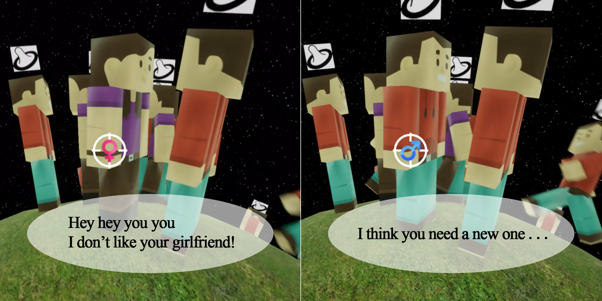

# Homos-Save-the-World
An amusing FPS game made for Lumdum Dare 42.

## Development Tools
* Unreal Engine 4.20
* Blender

## Credits
* Models: Kenny (https://www.kenney.nl/assets)
* Graphics: Kenny, PSDGraphics (http://psdgraphics.com)
  - “Condom Icon” made by Smashicons from www.flaticon.com
  - “Family Icon” made by Freepik from www.flaticon.com
* Music: Green Bear Music (https://greenbearmusic.bandcamp.com/)

## Game Links
* https://ldjam.com/events/ludum-dare/42/homos-save-the-world
* https://atom0520.itch.io/homos-save-the-world

 

